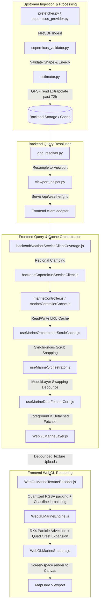

# Raw Surf — Weather Simulation System Forensics & Handoff Report

**Date:** June 22, 2026  
**Active Branch:** `dev` · **Repository:** `Raw-Surf`  
**Status:** All timeline scrubbing, heatmap loading, and regional Copernicus out-of-coverage fixes have been implemented, tested green (328/328 tests passing), committed, and pushed to the `dev` branch.

---

## 1. Executive Summary of Staged & Pushed Fixes

The following fixes have been applied and successfully pushed to `dev`:
1. **Copernicus Bounding Box Boundary Verification:**
   - **File:** [backendWeatherServiceClientCoverage.js](file:///c:/Users/dprit/Raw-Surf/frontend/src/components/map/backendWeatherServiceClientCoverage.js)
   - **Fix:** In `clampViewportBbox`, added a strict bounding box intersection check for the regional Copernicus `EURO` model. If the viewport is completely outside of CMEMS regional tile boundaries (e.g. panned to the Pacific), it returns `isInside: false` with `fallbackReason: "outside_coverage_clear"`.
   - **Result:** Prevents useless network queries that previously triggered 404 errors, causing the model transition coordinator to default to recovery grids.
2. **Debounced Raster Tile Resolution on Drag Pause:**
   - **File:** [useOpenMeteoTileUrls.js](file:///c:/Users/dprit/Raw-Surf/frontend/src/components/map/useOpenMeteoTileUrls.js)
   - **Fix:** Replaced checks for `window.isScrubbingTimeline || isScrubbingRef.current` with just `isScrubbingRef.current` in `runTransitionsAudit`, its RAF callback, and `resolveAllUrls`.
   - **Result:** Allows the raster overlay tiles (rain, satellite, pressure, fog) to resolve their URLs and transition when the user pauses their drag on the timeline (since `isScrubbingRef.current` becomes `false` after 300ms of inactivity, even though `window.isScrubbingTimeline` remains `true` due to the mouse being held down).
3. **Debounced Scrub-Settle Safety Net:**
   - **File:** [useMarineOrchestrator.js](file:///c:/Users/dprit/Raw-Surf/frontend/src/components/map/useMarineOrchestrator.js)
   - **Fix:** Increased the safety net checks' timeouts. `handleScrubEnd` now uses a `200ms` delay (instead of `20ms`), and the interval check uses a `250ms` delay (instead of `150ms`).
   - **Result:** Absorbs rapid clicking sequences and autoplay frame changes, avoiding the network request abort storms.

---

## 2. Weather Simulation System Forensics & Architecture Map

This section charts every component, file, and connection in the Raw Surf weather simulation system.

---

## 3. Comprehensive File-by-File Forensics

### 3.1 Backend Ingestion & Processing Layers
- [prefetcher.py](file:///c:/Users/dprit/Raw-Surf/backend/services/weather_pipeline/prefetcher.py): Cron-driven downloads for GFS, ICON, and Copernicus. Manages local caching and directory purging.
- [copernicus_provider.py](file:///c:/Users/dprit/Raw-Surf/backend/services/weather_pipeline/providers/copernicus_provider.py): CMEMS API client. Handles authentication and handles raw NetCDF grids.
- [copernicus_validator.py](file:///c:/Users/dprit/Raw-Surf/backend/services/weather_pipeline/copernicus_validator.py): Gates ingested grids to verify shape integrity (`len(vectors) == cols * rows`) and energy threshold (`nonzeroCount > 0`). Quarantines flat or corrupt products.
- [estimator.py](file:///c:/Users/dprit/Raw-Surf/backend/services/weather_pipeline/estimator.py): Blends persistency, GFS trends, and ICON trends Circular average weights to compute wave vector properties ($U, V$, height, period, direction) for deep forecast horizons (72h to 240h).
- [grid_resolver.py](file:///c:/Users/dprit/Raw-Surf/backend/services/weather_pipeline/grid_resolver.py): Direct API service handler for `/api/weather/grid`. Triggers bilinear resampling on active bounding box.
- [viewport_helper.py](file:///c:/Users/dprit/Raw-Surf/backend/services/weather_pipeline/viewport_helper.py): Bounding box clamping, grid culling, and zoom-dependent resolution down-sampling.

### 3.2 Frontend Client Services & Caching
- [backendWeatherServiceClient.js](file:///c:/Users/dprit/Raw-Surf/frontend/src/components/map/backendWeatherServiceClient.js): Main API client adapter. Manages manifest cache and shared valid times.
- [backendCopernicusServiceClient.js](file:///c:/Users/dprit/Raw-Surf/frontend/src/components/map/backendCopernicusServiceClient.js): Adapts CMEMS JSON points/grids to WebGL-compatible structures. Handles diagnostics logging.
- [backendWeatherServiceClientCoverage.js](file:///c:/Users/dprit/Raw-Surf/frontend/src/components/map/backendWeatherServiceClientCoverage.js): Bounding box projection and tile intersection logic. Contains `clampViewportBbox` coordinates clamping and checking.
- [marineController.js](file:///c:/Users/dprit/Raw-Surf/frontend/src/components/map/marineController.js): Unified interface for cache hits and network requests.
- [marineControllerCache.js](file:///c:/Users/dprit/Raw-Surf/frontend/src/components/map/marineControllerCache.js): Manages `_perModelHourCache` (LRUMap of size 50). Tracks cache hits, misses, evictions, and signatures.
- [marineControllerExtractor.js](file:///c:/Users/dprit/Raw-Surf/frontend/src/components/map/marineControllerExtractor.js): Interpolates hourly indices to build discrete hour frames from block caches.

### 3.3 Frontend Orchestration & Scrubbing
- [useMarineOrchestrator.js](file:///c:/Users/dprit/Raw-Surf/frontend/src/components/map/useMarineOrchestrator.js): Central orchestrator. Manages model/layer changes, safety net checks, and time series pre-warming.
- [useMarineOrchestratorScrubCache.js](file:///c:/Users/dprit/Raw-Surf/frontend/src/components/map/useMarineOrchestratorScrubCache.js): Instantly reads and commits exact hourly series frames from cache during slider dragging.
- [useMarineDataFetcher.js](file:///c:/Users/dprit/Raw-Surf/frontend/src/components/map/useMarineDataFetcher.js): Standard state wrapper for fetching grids.
- [useMarineDataFetcherCore.js](file:///c:/Users/dprit/Raw-Surf/frontend/src/components/map/useMarineDataFetcherCore.js): Dispatches grid request, dedupes fetches via `Abort-Gate`, handles detached background requests, and commits outputs.
- [useOpenMeteoTileUrls.js](file:///c:/Users/dprit/Raw-Surf/frontend/src/components/map/useOpenMeteoTileUrls.js): Resolves tiles (rain, satellite, etc.) and coordinates style load safety fallbacks.
- [useModelTransition.js](file:///c:/Users/dprit/Raw-Surf/frontend/src/components/map/useModelTransition.js): Fade durations, model caches, confidence damping, and variable cascades.

### 3.4 WebGL Rendering & GPU Shaders
- [MapWebGL.js](file:///c:/Users/dprit/Raw-Surf/frontend/src/components/map/MapWebGL.js): Integrates custom layers into MapLibre view.
- [WebGLMarineLayer.js](file:///c:/Users/dprit/Raw-Surf/frontend/src/components/map/WebGLMarineLayer.js): Component wrapper for GL canvas. Updates textures and triggers renders.
- [WebGLMarineTextureEncoder.js](file:///c:/Users/dprit/Raw-Surf/frontend/src/components/map/WebGLMarineTextureEncoder.js): Packs float components ($U, V$, height, period) into 8-bit RGBA pixels. Extrapolates boundary ocean values into adjacent land.
- [WebGLMarineEngine.js](file:///c:/Users/dprit/Raw-Surf/frontend/src/components/map/WebGLMarineEngine.js): GPU framebuffers for particle RK4 advection and quad ribbon vertices.
- [WebGLMarineShaders.js](file:///c:/Users/dprit/Raw-Surf/frontend/src/components/map/WebGLMarineShaders.js): Swell shaders (`HEATMAP_FS`, `WAVE_VS`). Computes spatial frequencies, wave temporal phase, and Northwestern directional light shading.
- [WebGLStateIsolation.js](file:///c:/Users/dprit/Raw-Surf/frontend/src/components/map/WebGLStateIsolation.js): Preserves/restores MapLibre's WebGL state (VAOs, buffers, blend modes) during custom layer draw cycles.

---

## 4. Next Steps & Instructions (For Claude Desktop)

The next developer (Claude Desktop) should review these changes and ensure that everything is operating correctly:
1. All changes are committed and pushed to `dev`.
2. Confirm that the Netlify staging deploy builds and loads successfully.
3. Inspect the floating FPS red flag and Prompt Diag Info on the Dev Netlify HUD to verify that:
   - Timeline clicks and scrubs resolve and render raster overlays precisely.
   - Panning to the Pacific (out-of-bounds Copernicus) cleanly disables the `EURO` layers without 404 console errors.
