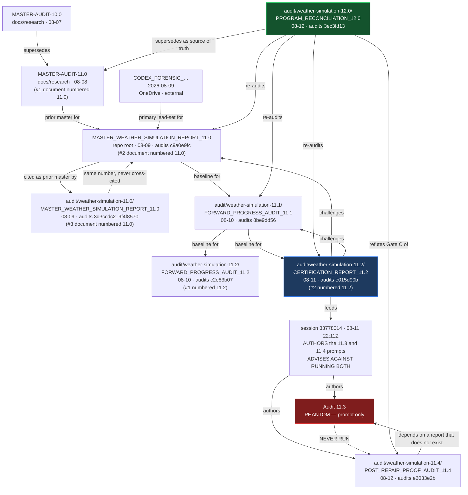

# AUDIT VERSION AND DEPENDENCY GRAPH

`dev` @ `3ec3fd13` · 2026-08-12 · nodes indexed in `AUDIT_SOURCE_INDEX.csv`

---

## 1. The program-numbered lineage

---

## 2. What the graph exposes

### 2.1 A phantom node with a live dependency edge

**Audit 11.4 depends on Audit 11.3, which does not exist.** Its commissioning prompt opens *"This
audit must run after the implementation mission authorized by Audit 11.3 has been completed."* Five
input documents are named; none exists.

The 11.3 prompt itself *does* exist — in session `33778014`, where it declares its own required
output, `WEATHER_SIM_ROOT_CAUSE_CLOSURE_AUDIT_11.3.md`. The same session, at 22:11:50Z, closed with:

> *"On the audit question: don't run 11.3, and don't run the 11.4 I wrote you."*

11.3 was not run. 11.4 was. **The dependency edge survived the deletion of its target.**

To 11.4's credit, it discovered this within 90 seconds and judged compliance against the Gate 6
measurement series instead, marking the uncheckable requirements *Unable to Verify* rather than
passed. That is the correct handling of a missing premise.

### 2.2 Three nodes share the number 11.0; two share 11.2; none is 11.3

| Number | Documents | Distinguishable only by |
|---|---|---|
| **11.0** | `docs/research/MASTER-AUDIT-11.0-2026-08-08-…` · repo-root `MASTER_WEATHER_SIMULATION_REPORT_11.0.md` (131 KB) · `audit/weather-simulation-11.0/MASTER_WEATHER_SIMULATION_REPORT_11.0.md` (69 KB) | path |
| **11.2** | `WEATHER_SIM_FORWARD_PROGRESS_AUDIT_11.2.md` (ON TRACK) · `WEATHER_SIM_CERTIFICATION_REPORT_11.2.md` (NOT CERTIFIED) | filename |
| **11.3** | — | — |

The repo-root 11.0 and the `audit/` 11.0 have the same title and version but audit **different
commits**, and the `audit/` one names the repo-root one as *its own prior master report*. They are
successive audits, not copies. `AUDIT_SOURCE_INDEX.csv` shows distinct SHA-256 values; there are
**zero byte-identical duplicates** anywhere in the 551-source corpus.

⚠️ **Consequence: the sentence "Report 11.0 said X" is ambiguous by construction**, and the
certification 11.2 explicitly flags itself as *"distinct from the Forward-Progress 11.2 at
`6d5d6c48`"* — the collision was known and shipped anyway.

### 2.3 A circular-reasoning risk that did *not* materialize

`R110a → R111 → R112c` is a chain in which each audit's baseline is its predecessor's HEAD. That
shape normally produces confirmation drift. **It did not here, and the reason is worth preserving:**
11.2 broke the chain deliberately by hash-locking its findings *before* reading 11.0 or 11.1
(`BLIND_FINDINGS_LOCK.txt`, SHA-256 `69DCAF8D…073715`, 23:24:57). It then found that both
predecessors had cited a parity PASS from an instrument that had been blind for ~10 weeks.

**The blind-first edge is the single most valuable methodological artifact in the graph.**

### 2.4 Edges that carry findings forward without closing them

| Finding | Introduced | Carried by | Status at HEAD |
|---|---|---|---|
| Runtime evidence capture (video) | 11.0 | 11.1, 11.2, 11.4 | **Open** — 4 nodes, 0 closures |
| External uptime probe | 11.0 (P0) | 11.1, 11.2 | **Open** |
| Paired accuracy criterion | 11.1 | — *(11.2/11.4 did not carry it at all)* | **Open, and now worse-evidenced** |
| Non-monotonic z8/z9/z10 selection | 11.0 Jacobian ("strongest single lead") | 11.2 RC-03 | **Open** — 11.2 notes it survived the whole 11.1 window |
| Integrity chain (checksums) | MASTER-AUDIT-11.0 | 11.0 R11-13 | **Open** |

⚠️ The paired-accuracy row is the important one: it was introduced by 11.1 and then **dropped from
the lineage entirely** — 11.2 and 11.4 do not mention it. A finding that stops being carried is not
a finding that was closed.

### 2.5 Implementation packets that were superseded before use

| Packet | Fate |
|---|---|
| `audit/weather-simulation-11.0/FIRST_IMPLEMENTATION_PACKET.md` | **Rewritten** at `8f1fcf41` because it *"specified building something that already exists"* |
| `audit/weather-simulation-11.1/NEXT_IMPLEMENTATION_PACKET.md` | Superseded within the same audit by `MISSION_2_REFUTATION_AND_CORRECTED_PACKET.md` |
| `audit/weather-simulation-11.4/AUTHORIZED_NEXT_GATE_PACKET.md` | **Stages 1, 2 and 4 were already complete at publication** (`ecfc1077`, 22 min earlier). Only Stage 3 is open |

**Three consecutive packets, three supersessions, one shared cause:** each was authored before the
evidence generated during its own audit window had been folded back in. This is the mechanism behind
governance rule 6 in the master report.

---

## 3. Node inventory by type

| Type | n |
|---|---|
| Handoff Report | 153 |
| Memory Entry (indexed subset) | 104 |
| Evidence Pack | 102 |
| Analysis / Finding | 85 |
| **Completed Audit Report** | **35** |
| Ledger / Matrix | 30 |
| Implementation Packet | 10 |
| Reference Doc | 9 |
| Executive Brief | 4 |
| Evidence Manifest | 4 |
| Unknown | 15 |
| **Total indexed** | **551** |

External nodes (outside the repo, `C:\Users\dprit\OneDrive\Documents\New project\`):
`CODEX_FINAL_WEATHER_SIMULATION_AUDIT_…2026-06-21`, `CODEX_FORENSIC_WEATHER_SIM_AUDIT_…2026-08-09`,
`OPUS5_WEATHER_SIM_DEEP_AUDIT_HANDOFF_2026-08-03`, `claude-4.8-weather-simulation-audit`.

⚠️ **These four are outside version control.** Report 11.0's primary lead-set is one of them. A
program input that can be edited or lost without a commit is a provenance gap
(`OPEN_BLOCKERS_AND_EVIDENCE_GAPS.md`, G-12.6).
