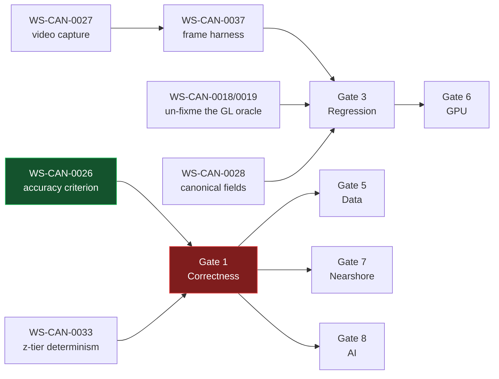

# DEPENDENCY AND RELEASE-GATE GRAPH

`dev` @ `3ec3fd13` · 2026-08-12

⚠️ **This document establishes ONE gate taxonomy for the program.** Audit 11.2 published gates
**1–8 by domain**; Audit 11.4 published gates **A–I by audit dimension**. They are different frames,
and 11.2's *Gate 1 Data Truth: FAIL* has no successor row anywhere in 11.4 — so it neither closed
nor stayed open. **12.0 adopts the domain taxonomy** (it describes the system, not the audit) and
maps both predecessors onto it below.

---

## 1. The gate ladder

```
Gate 0 — SOURCE OF TRUTH                                          ◐ PARTIAL
  ✅ canonical task register (this audit)
  ✅ current architecture map (this audit)
  ✅ known-good baseline: dev @ 3ec3fd13, backend 69865877, dev FE 3ec3fd13
  ❌ WS-CAN-0025  external uptime probe            (11.0 P0, never started)
  ❌ WS-CAN-0021  rotate committed credentials     (owner)
  ❌ WS-CAN-0039  unfreeze production frontend     (owner)
  ❌ WS-CAN-0040  read Render env screen           (owner)
  ❌ WS-CAN-0041  uninstall Vercel app             (owner)
  ❌ WS-CAN-0055  prune 5 orphan worktrees
  ❌ WS-CAN-0056  one gate taxonomy                (this doc starts it)

Gate 1 — CORRECTNESS                                              ⛔ FAIL
  ✅ units / direction / grid orientation      (WeatherNormalizer, single authority)
  ✅ projection                                (11.2 certified, incl. a self-refuted false positive)
  ✅ cursor / render agreement                 (parity now REFUSES on unsampled)
  ✅ JS/Python rating parity across the 0.50 gate   WS-CAN-0002
  ❌ WS-CAN-0026  accuracy criterion grades the wrong quantity   ◀── THE MISSION
  ❌ WS-CAN-0005  run_time is ingest time, not the model cycle
  ❌ WS-CAN-0014  resolution never populated
  ❌ WS-CAN-0009  HTTP 200 with an error body (9 sites)
  ❌ WS-CAN-0007  ICON >168 h has two live compositions
  ❌ WS-CAN-0033  z8/z9/z10 selection is non-deterministic
  ❌ WS-CAN-0010  third fabricated status surface
  ❌ WS-CAN-0017  no integrity checksum anywhere
  ❌ WS-CAN-0024  band vs glyph sub-term not isolated
  ❌ WS-CAN-0029  freshness_sec means nothing

Gate 2 — LIFECYCLE AND OWNERSHIP                                  ◐ PARTIAL
  ✅ WS-CAN-0001  churn loop bounded (3 seams)
  ✅ stale-response rejection (request ids + live-target identity)
  ✅ WS-CAN-0008  worker cleanup / crash recovery
  ✅ GPU teardown (historical concern closed)
  ❌ WS-CAN-0022  WeatherTelemetry RAF has no cancel path
  ❌ WS-CAN-0036  re-run failure injection at HEAD
  ❌ WS-CAN-0013  encoder error-rollback (c) never independently verified

Gate 3 — REGRESSION PROTECTION                                    ◐ PARTIAL
  ✅ golden fixtures (4,320 rows, byte-current)
  ✅ deterministic + differential tests (argmin, 3000-fixture arbiter)
  ✅ mutation-killed guard matrices (46/46)
  ✅ WS-CAN-0031  verdict-cache guardrail   ◀── RV-04 REFUTES 11.4 Gate C: it HOLDS
  ❌ WS-CAN-0018/0019  executed-GL oracle is test.fixme — cannot red CI
  ❌ WS-CAN-0028  synthetic canonical fields never run
  ❌ WS-CAN-0027  no video / trace / profile capture (4 audits)
  ❌ WS-CAN-0037  no headed frame harness
  ❌ WS-CAN-0045  non-vacuity guard
  ❌ worker reply-ordering test

Gate 4 — LOW-RISK PERFORMANCE                                     ◐ PARTIAL
  ✅ duplicate work removed (argmin, manifest index, deepcopy, batch route)
  ✅ mask verdict cache (88% static hit, 0% control arm)
  ✅ isEnabled over getParameter (1411-1519 → 960-1292 ms, non-overlapping)
  ❌ WS-CAN-0020  client telemetry uplink
  ⏸ WS-CAN-0043  arbiter arming — BENCHMARK FIRST (read arb_shadow_diverge)
  ⏸ WS-CAN-0032  settle debounce — default-OFF until a human watches a pan
  ❌ WS-CAN-0044  p2 exclude-precedence inversion (blocks any canary)

Gate 5 — DATA MODERNIZATION                                       ⛔ REJECTED / DEFERRED
  ⛔ WS-CAN-0046  Zarr / Kerchunk / COG / Dask — REJECTED 3×
  ⏸ WS-CAN-0052  SURF_PARTITIONS  (blocker WS-CAN-0002 is now CLOSED; cap-seam + owner remain)
  ⏸ WS-CAN-0053  SURF_TIDE_DEPTH  (needs break-depth completion + a positive-control census)
  ⏸ WS-CAN-0042  calibration bound — OWNER. NEVER WIDEN
  ⏸ WS-CAN-0054  skill-gate arming (~2026-08-22)

Gate 6 — NUMERICAL / GPU MODERNIZATION                            ⛔ BLOCKED
  ⛔ WS-CAN-0047  JAX / CuPy / Numba — REJECTED (4 s CPU global forecast)
  ⏸ WS-CAN-0050  WebGPU / OffscreenCanvas  ◀── blocked on Gate 3 WS-CAN-0037
  ⏸ WS-CAN-0011  dt-normalized advection

Gate 7 — NEARSHORE MODELING                                       ⛔ BLOCKED
  ⛔ WS-CAN-0048  SWAN / FVCOM / GNN / nested grids — REJECTED 3×
  ⏸ break-depth + tile coverage continuation   ◀── the actual binding constraint
  ⏸ coastal shadowing wiring
  ⏸ one nearshore DISPLAY policy (within WS-CAN-0015)
      ◀── blocked on Gate 1 WS-CAN-0033: a finer model cannot be validated while a fixed
          coordinate's value depends on interaction history

Gate 8 — AI-ASSISTED FORECASTING                                  ⛔ BLOCKED AT THE PREMISE
  ⏸ WS-CAN-0049  bias correction / blending / learned downscaling
  ⏸ WS-CAN-0051  learned nearshore transform (the dataset is not growing — that IS the finding)
      ◀── blocked on Gate 1 WS-CAN-0026: you cannot fit a learned correction toward a
          baseline you have not yet beaten
```

---

## 2. The critical path



**Gate 1 is the binding constraint on Gates 5, 7 and 8 simultaneously. Gate 3 is the binding
constraint on Gate 6. Gate 0 blocks nothing — and contains the cheapest items in the program.**

---

## 3. Tasks whose ordering has repeatedly been wrong

| Task | Wrong ordering that recurred | Correct ordering |
|---|---|---|
| WS-CAN-0049 (AI correction) | Repeatedly evaluated as a *technology* decision | It is blocked at the **premise**. Fix the gate (0026), then beat the baseline, *then* it is debatable |
| WS-CAN-0050 (WebGPU) | Evaluated on architecture merit | Blocked on **measurability** — you cannot A/B a frame rate you cannot read |
| WS-CAN-0048 (nearshore models) | Evaluated as physics | Blocked on **determinism + coverage**, three audits running |
| WS-CAN-0046 (Zarr) | Re-debated as a technology 5× | The **objective** was latency reduction; the measured latency root is elsewhere. Re-measure the objective, never re-debate the technology |
| WS-CAN-0032 (settle debounce) | Would naturally follow the cache as "the next perf lever" | It is a **visible-behaviour** change. A human watches a pan first |
| WS-CAN-0043 (arbiter) | "Arm it, it's differential-tested" | **Read `arb_shadow_diverge` first.** 3000 fixtures prove agreement on fixtures, not on production traffic |

---

## 4. Mapping the two historical gate matrices onto this ladder

| 11.2 gate (domain) | 11.2 verdict | Maps to | State at HEAD |
|---|---|---|---|
| 1 Data Truth | FAIL | Gate 1 | **Still FAIL** — 0005, 0014, 0009, 0033 open |
| 2 Projection Truth | CONDITIONAL PASS | Gate 1 | **PASS**, residual = canonical fields (0028) |
| 3 State and Concurrency | FAIL | Gate 2 | **PARTIAL** — 0001 and 0008 closed since |
| 4 Animation and Lifecycle | PASS | Gate 2 | **PASS** — *do not refactor* |
| 5 Scientific Conformance | FAIL | Gate 1 | **Still FAIL** — and now with a live measurement (0026) |
| 6 Capacity | CONDITIONAL PASS | Gate 4 | **PARTIAL** — cost model cross-validated; headroom 87.0% |
| 7 Regression Protection | FAIL | Gate 3 | **PARTIAL** — 0031 closed; optical layer still absent |
| 8 Modernization Readiness | FAIL | Gates 5–8 | **Still blocked**, by Gate 1 |

| 11.4 gate (dimension) | 11.4 verdict | Disposition |
|---|---|---|
| A Mission Compliance | CONDITIONAL PASS | Audit-process, not a system gate — **retire** |
| B Causal Closure | CONDITIONAL PASS | → Gate 4, **PASS** |
| **C Test Integrity** | **FAIL** | → Gate 3. ⛔ **REFUTED at HEAD by RV-04.** Reclassify **PASS**, residual 0045 |
| D Scientific Integrity | PASS | → Gate 1 (repair scope only) — **PASS** |
| E Projection and Animation | BLOCKED | → Gates 1 + 2. Blocked on 0027/0037, not on the code |
| F Concurrency and Lifecycle | CONDITIONAL PASS | → Gate 2, **PARTIAL** |
| G Performance and Capacity | CONDITIONAL PASS | → Gate 4, **PARTIAL** |
| H Rollback and Observability | PASS | → Gate 0, **PASS** |
| **I Next-Phase Readiness** | **FAIL** | Derived *"follows from C"*. **C is refuted ⇒ I no longer stands on its stated basis.** Gate 1 is the real blocker |

⭐ **Note the substitution.** 11.4's headline — *NEXT ENGINEERING GATE NOT AUTHORIZED* — turns out to
be **right for the wrong reason**. The next engineering gate genuinely should not open, but the
blocker is **Gate 1 correctness (WS-CAN-0026)**, not Gate C test integrity. Acting on the stated
reason would have spent a session repairing a guardrail that already held.
