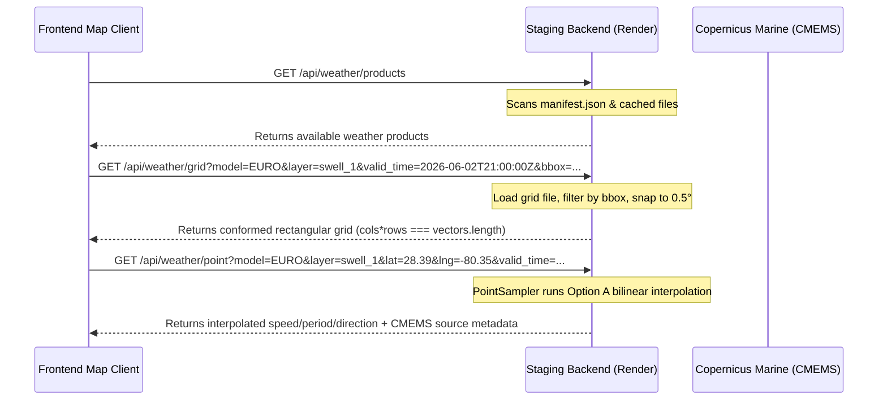

# Weather Backend Migration Roadmap

This document serves as the canonical roadmap and active architecture guide for the **Raw Surf Weather & Marine Data Simulation Engine**. It outlines our transition to a backend-owned forecast architecture, documents completed validation stages (including Copernicus Waves and GFS/ICON/EURO Wind), and details the remaining phased work for pressure, precipitation, radar, satellite, and temperature layers.

For the detailed status of all weather and marine layers, see the [weather-support-matrix.md](file:///C:/Users/dprit/Raw-Surf/docs/architecture/weather-support-matrix.md).

---

## 1. The North Star Architecture

Our core system design separates data ownership and visualization responsibilities:

> [!IMPORTANT]
> **Backend owns weather truth.** It performs all network requests, dataset queries, temporal and spatial normalizations, memory caching, and point interpolation.  
> **Frontend owns visualization.** It consumes clean API responses, renders WebGL heatmaps or particle overlays, maps timelines, and exposes diagnostic states.

> [!NOTE]
> **Pressure Layer Visuals Exceptions**:
> The map visual pressure raster contours and heatmap remain owned by the hourly legacy `om://` tiles. The backend pressure service only owns the scalar numeric point truth (`value` in hPa, NOT vector components like speed/direction) for the map inspector infobox.

### Frontend Responsibilities
The client-side application must only:
* Query the active products manifest.
* Fetch WebGL-ready coordinate grids filtered dynamically by bounding boxes (`bbox`).
* Query interpolated point/infobox forecasts for map inspector events.
* Request tile indexes or signed CDN URLs for radar/satellite layers.
* Render hardware-accelerated WebGL heatmaps and flow particles.
* Expose diagnostics states and handle unavailable fallbacks cleanly.

### Frontend Restrictions (Anti-Patterns)
The client-side application must **not**:
* Fetch raw forecast parameters directly from external weather APIs (e.g. Open-Meteo or Copernicus).
* Run NetCDF/GRIB download operations.
* Fabricate synthetic weather values or generate in-memory mock fallbacks.
* Perform model-specific math or meteorology calculations.
* Duplicate weather ingestion or storage pipelines.

---

## 2. Backend Weather Product Contract

The weather engine exposes three core REST endpoints on the backend service, with additional endpoints planned for tile and timeline queries.

### API Endpoints
* **`GET /api/weather/products`**: Returns the manifest registry listing available prepared weather products, freshness timestamps, and files cached on disk.
* **`GET /api/weather/grid`**: Returns a compact normalized coordinate grid. Acceptable query parameters: `model`, `domain`, `layer`, `valid_time`, and an optional boundary filtering `bbox`.
* **`GET /api/weather/point`**: Samples from the exact same cached product grid used for the map grids, ensuring absolute grid-to-point parity. Returns interpolated values or handles bounds fallbacks.
* **Future `GET /api/weather/tile` or `/api/weather/tiles`**: Will handle imagery-based products (radar, satellite) by returning signed tile URLs or session tokens.
* **Future `GET /api/weather/timeline`**: Will return a compact array of available valid time slices across all layers to sync timeline scrub controls dynamically.

### Schema Fields & Metadata
All backend products and point/grid responses propagate these metadata fields:

| Field | Type | Description |
| :--- | :--- | :--- |
| **`model`** | `str` | Name of the forecast model (e.g., `GFS`, `ICON`, `EURO`). |
| **`provider`** | `str` | Ingestion source (e.g., `open-meteo`, `copernicus`). |
| **`domain`** | `str` | Data domain (`marine` or `wind`). |
| **`layer`** | `str` | Target physical parameter layer (e.g., `waves`, `swell_1`, `swell_2`, `wind`). |
| **`valid_time_start`** | `datetime` | Starting validation timestamp (ISO-8601 UTC). |
| **`valid_time_end`** | `datetime` | Ending validation timestamp (ISO-8601 UTC). |
| **`run_time`** | `datetime` | Model execution/ingestion run timestamp. |
| **`coverage`** | `CoverageBounds` | Geographic coordinates bounds containing the grid values. |
| **`units`** | `dict` | Maps variables to standard units (e.g., speed to `m` or `kn`, period to `seconds`). |
| **`source_dataset`** | `str` | The real CMEMS or NOAA source dataset name (e.g., `cmems_mod_glo_wav_anfc_0.083deg_PT3H-i`). |
| **`source_variables`** | `List[str]` | The specific variable codes queried from the source dataset (e.g., `["VHM0_SW1", "VMDR_SW1", "VTM01_SW1"]`). |
| **`is_forecast_authoritative`**| `bool` | True only if the forecast contains real live forecast measurements. |
| **`is_estimated`** | `bool` | True if the forecast is interpolated, out-of-bounds, or uses fallbacks. |
| **`is_test_fixture`** | `bool` | True if the product is a mock test file. Never allowed in production manifests. |
| **`freshness_sec`** | `int` | Ingestion validity window (e.g., `1800` seconds). |
| **`gridMode`** | `str` | Grid layout description (must be `"rectangular"`). |
| **`interpolationMethod`** | `str` | Point lookup method (`"bilinear"`, `"bilinear_ocean_masked"`, `"nearest_ocean_fallback"`, `"out_of_bounds_fallback"`, or `"unavailable"`). |
| **`fallbackReason`** | `str` | Logs details of why a fallback or estimate occurred. |

---

## 3. Completed Stages

We have forensically implemented and verified these weather backend milestones:

* **Stage 1: Backend Weather Product Foundation**: Created conformed schemas, store registry, and manifest.
* **Stage 2: GFS Waves Pilot**: Ingested GFS wave grid from Open-Meteo with wind vector conversions.
* **Stage 2.7: Deployed GFS Waves Truth Gate**: Verified staging and client redirections.
* **Stage 3A-C: Backend GFS Wind Pilot + Deployed Truth Gate**: Integrated wind particle flow vectors.
* **Stage 4A.1-4A.5: Copernicus Swell 1 Pilot**: Added regional CMEMS extraction under 512MB RAM cap.
* **Stage 4A.6: Grid Coherence and Point Hardening**: Standardized Option A bilinear ocean-masked coastline point sampling.
* **Stage 4B: Copernicus Swell 2 Ingest & Data Proof**: Integrated secondary swell (`swell_2`).
* **Stage 4C: Copernicus Wind Waves Ingestion**: Integrated conformed wind waves (`wind_waves`).
* **Stage 4D: Copernicus Base EURO Waves Ingestion**: Consolidated all EURO wave heights to Copernicus.
* **Stage 4E: GFS Marine Components Ingestion**: Conformed GFS waves, swell_1, swell_2, and wind_waves to backend.
* **Stage 4F: ICON Marine Components Ingestion**: Conformed ICON waves, swell_1, and wind_waves to backend (swell_2 unsupported).
* **Stage 5C: ICON Wind Ingestion**: Integrated ICON wind with gust support.
* **Stage 5D: EURO Wind Ingestion**: Integrated EURO wind (`ecmwf_ifs`) with gust support.
* **Stage 5E: Wind Consolidation Gate**: Verified timeline parity and protected ingestion endpoints.
* **Stage 5F: Wind Default-On Rollout**: Enabled backend wind service by default on map client.
* **Stage 5G: Wind Post-Rollout Stabilization Watch**: Verified default-on redirection stability.
* **Stage 6C: Pressure Backend Migration Plan**: Analyzed pressure layer structure and upstream sources.
* **Stage 6D: GFS Pressure Backend Pilot**: Integrated GFS weather pressure under default-off feature flag.
* **Stage 6E: ICON/EURO Pressure Ingestion + Redirects**: Extended pressure pilot to ICON and EURO models, reframing parity as snapped tolerance parity.
* **Stage 6F: Pressure Consolidation Gate**: Hardened out-of-coverage semantics, conformed diagnostics keys, and consolidated pressure matrices.

---

## 4. Backend-Owned Product Pipeline Architecture

The weather data pipeline is structured for efficiency, correctness, and stability under strict memory and API limits.

### A. Provider Ingestion Model
Ingestion is orchestrated via `scheduler.py`:
* **Open-Meteo Ingestion**: Grid coordinate requests are chunked into batches of **100 coordinates** to prevent HTTP 414 URI Too Long. An inter-request delay is enforced (2.5s for wind, 1.2s for marine) to respect API rate limits.
* **Copernicus Ingestion**: Subprocess NetCDF downloads are capped to prevent out-of-memory crashes on Render. Python garbage collection (`gc.collect()`) is run aggressively between cycles.

### B. Product Manifest Behavior
* The master catalog `manifest.json` registers all available weather files.
* Every grid and point API query scans this manifest to locate the conformed file closest to the requested coordinate/valid_time.
* Atomic file replacements (`os.replace`) prevent partial grid files from being read.

### C. API Endpoint Contracts
* **`/api/weather/grid`**: Receives target model, domain, layer, and ISO-8601 valid_time. Bounding box filters (`bbox=west,south,east,north`) are evaluated on the fly to slice the rectangular grid coordinates.
* **`/api/weather/point`**: Evaluates coordinate sample requests. Uses the **Option A** IDW bilinear interpolation algorithm to interpolate values over ocean grid nodes, safely filtering out coastal land interference.

### D. Temporal Valid-Time Snapping
* Grid and point queries snap target timestamps to the closest available manifest product validity window (within a **3-hour delta limit**). If a valid slice is beyond 3 hours, a `404 Not Found` response is raised.

### E. Frontend Adapter Pattern
* `backendWeatherServiceClient.js` wraps backend network queries, clamps viewport bounding boxes, maps models to their upstream API identifiers (e.g. mapping `model: 'EURO'` to `upstream_model: 'ecmwf_ifs'`), and updates diagnostics telemetry.

### F. Feature Flags & Rollback Strategy
* **Runtime Rollbacks**: The console global `window.__USE_BACKEND_WIND_SERVICE__ = false` or the local storage key `__USE_BACKEND_WIND_SERVICE__ = 'false'` instantly roll back wind fetches to legacy pathways. Similar overrides exist for marine (`__USE_BACKEND_MARINE_SYSTEM__ = false`).
* **Build-Time Rollbacks**: Compiling the app with `REACT_APP_USE_BACKEND_WIND=false` or `REACT_APP_USE_BACKEND_MARINE_SYSTEM=false` overrides default-on behavior at build time.

### G. Diagnostics Telemetry Objects
Globals are registered on `window` to check telemetry:
* `window.__BACKEND_WEATHER_SERVICE_DIAG__` (GFS marine)
* `window.__BACKEND_WIND_SERVICE_DIAG__` (wind models)
* `window.__BACKEND_COPERNICUS_SERVICE_DIAG__` (EURO/Copernicus marine)

### H. Unsupported and No-Coverage Semantics
* Coordinates falling outside the Florida pilot bbox (`PILOT_COVERAGE`) return `is_estimated = False` with `is_forecast_authoritative = False` and `point.interpolation_method = "out_of_bounds_fallback"`, indicating no coverage exists rather than presenting it as a real forecast estimate.
* Unsupported layer requests (e.g., ICON `swell_2`) return a conformed mock response with `status: 'unsupported'` safely to prevent API queries or crashes.

### I. Test-Fixture Quarantine Rules
* Deployed environments strictly prohibit mock files. The scheduler checks `is_test_env` before saving files. Any product marked with `is_test_fixture = True` is blocked from registry writes.

### J. Scheduler Rate-Limit Strategy
* A **15.0-second stagger delay** separates all manual ingestion background tasks.
* A staggered retry backoff multiplier (`12s * attempt`) handles any HTTP 429 response from Open-Meteo.

---

## 5. Legacy Fallback Audit

While marine and wind systems are fully backend default-on, their legacy serverless proxy scraper paths remain intact:
* **Retained Marine Paths**: Frontend direct fetches to the Open-Meteo Marine API, client-side GFS/ICON GRIB parsing, and Copernicus tile loaders in `useMarineOrchestrator.js` and `marineController.js`.
* **Retained Wind Paths**: Client-side scrapers in `windController.js` and direct point sampling queries in `forecastSamplers.js`.
* **Rollback Usefulness**: Provides immediate redundancy in case of staging server outages (Render 502/OOM errors), Copernicus API credential locks, or Open-Meteo IP address blocks.
* **Sunsetting Candidates**: Once the backend service proves stable across a **30-day confidence window**, client-side NetCDF/GRIB download and legacy Open-Meteo scrapers can be removed.

---

## 6. Remaining Layers Source-Truth Plan

We will evaluate the remaining map layers for migration to the backend-owned weather engine:

### A. Sea-Level Pressure
* **Likely Source**: Open-Meteo Forecast API (`gfs_seamless`, `dwd_icon`, `ecmwf_ifs`).
* **Data Type**: Forecast model grid parameters (`pressure_msl`).
* **Backend Fit**: Fits the backend grid/point product model perfectly. Can be normalized into conformed JSON grids.
* **Licensing/API Risks**: None. Included under standard Open-Meteo licenses.
* **Difficulty**: Low.

### B. Precipitation (Rain/Snow)
* **Likely Source**: Open-Meteo Forecast API (`precipitation`).
* **Data Type**: Forecast model grid parameters (precipitation values in `mm`).
* **Backend Fit**: Fits the backend grid/point product model.
* **Licensing/API Risks**: None.
* **Difficulty**: Low.

### C. Weather Radar
* **Likely Source**: RainViewer API or NOAA MRMS.
* **Data Type**: Real-time mosaic tiles.
* **Backend Fit**: Radar is a dynamic observation layer, not a forecast model. It does not fit the JSON point/grid model.
* **Architecture Fit**: Should remain tile-based, loaded via MapLibre overlay protocols, but timeline timestamps and tile endpoints can be queried via the backend.
* **Licensing/API Risks**: RainViewer has specific rate limits and attribution requirements.
* **Difficulty**: Medium.

### D. Satellite Imagery
* **Likely Source**: NOAA GOES / NASA GIBS.
* **Data Type**: Real-time observational tile maps.
* **Backend Fit**: Observational overlay, does not fit JSON point/grid model.
* **Architecture Fit**: Should remain tile-based (MapLibre overlay protocols) with timeline synchronization managed by the backend.
* **Difficulty**: Medium.

### E. Air Temperature (Future)
* **Likely Source**: Open-Meteo Forecast API (`temperature_2m`).
* **Data Type**: Forecast scalar field.
* **Backend Fit**: Fits point sampling and grid structures.
* **Difficulty**: Low.

### F. Sea Surface Water Temperature (Future)
* **Likely Source**: NOAA RTG_SST or CMEMS Global Ocean SST.
* **Data Type**: Daily observation/forecast.
* **Backend Fit**: Fits point sampling and grid structures.
* **Difficulty**: Medium (requires parsing Copernicus/NOAA daily grids).

### Recommended Migration Order
1. **Stage 6G**: Pressure Default-On Rollout (default-enable backend pressure point truth).
2. **Stage 6H**: Weather Coverage Expansion Strategy & Architecture (current).
3. **Stage 6H.1**: SoCal Wind Tile Pilot (GFS/ICON/EURO wind tile expansion).
4. **Stage 6H.2**: SoCal Marine Tile Pilot.
5. **Stage 7**: Precipitation Backend Ingestion.
6. **Stage 8**: Air & Water Temperature point sampling integration.
7. **Stage 9**: Radar & Satellite endpoint validation.

---

## 7. Recommended Next Phase

Following the approval of the Stage 6H strategy, we recommend proceeding to **Stage 6H.1: SoCal Wind Tile Pilot** to implement the hybrid regional tile wind coverage expansion for Southern California. Radar, satellite, precipitation, and Copernicus/pressure changes remain future work.

