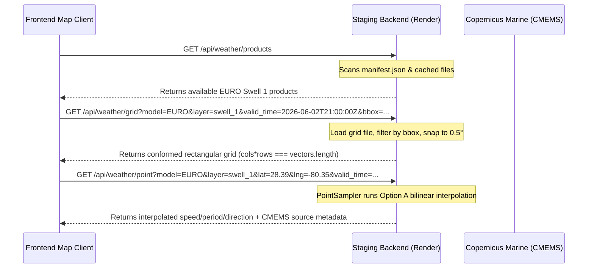

# Weather Backend Migration Roadmap

This document serves as the canonical roadmap and active architecture guide for the **Raw Surf Weather & Marine Data Simulation Engine**. It outlines our transition to a backend-owned forecast architecture, summarizes the completed and conformed validation stages (including the latest **Stage 4A.6** grid coherence proofs), and details the remaining phased work for wind, marine, atmospheric, radar, satellite, and temperature layers.

---

## 1. The North Star Architecture

Our core system design separates data ownership and visualization responsibilities:

> [!IMPORTANT]
> **Backend owns weather truth.** It performs all network requests, dataset queries, temporal and spatial normalizations, memory caching, and point interpolation.  
> **Frontend owns visualization.** It consumes clean API responses, renders WebGL heatmaps or particle overlays, maps timelines, and exposes diagnostic states.

### Frontend Responsibilities
The client-side application must only:
* Query the active products manifest.
* Fetch WebGL-ready coordinate grids filtered dynamically by bounding boxes (`bbox`).
* Query interpolated point/infobox forecasts for map inspector events.
* Request tile indexes or signed CDN URLs for radar/satellite layers.
* Render hardware-accelerated WebGL heatmaps and flow particles.
* Expose diagnostics states and handle unavailable fallbacks cleanly.

### Frontend Restrictions (Anti-Patterns)
The client-side application must **not**:
* Fetch raw forecast parameters directly from external weather APIs (e.g. Open-Meteo or Copernicus).
* Run NetCDF/GRIB download operations.
* Fabricate synthetic weather values or generate in-memory mock fallbacks (except for isolated dev-environment proxy rate shielding).
* Perform model-specific math or meteorology calculations.
* Duplicate weather ingestion or storage pipelines.

---

## 2. Backend Weather Product Contract

The weather engine exposes three core REST endpoints on the backend service, with additional endpoints planned for tile and timeline queries.

### API Endpoints
* **`GET /api/weather/products`**: Returns the manifest registry listing available prepared weather products, freshness timestamps, and files cached on disk.
* **`GET /api/weather/grid`**: Returns a compact normalized coordinate grid. Acceptable query parameters: `model`, `domain`, `layer`, `valid_time`, and an optional boundary filtering `bbox`.
* **`GET /api/weather/point`**: Samples from the exact same cached product grid used for the map grids, ensuring absolute grid-to-point parity. Returns interpolated values or handles bounds fallbacks.
* **Future `GET /api/weather/tile` or `/api/weather/tiles`**: Will handle imagery-based products (radar, satellite) by returning signed tile URLs or session tokens.
* **Future `GET /api/weather/timeline`**: Will return a compact array of available valid time slices across all layers to sync timeline scrub controls dynamically.

### Schema Fields & Metadata
All backend products and point/grid responses must propagate these metadata fields:

| Field | Type | Description |
| :--- | :--- | :--- |
| **`model`** | `str` | Name of the forecast model (e.g., `GFS`, `ICON`, `EURO`). |
| **`provider`** | `str` | Ingestion source (e.g., `open-meteo`, `copernicus`). |
| **`domain`** | `str` | Data domain (`marine` or `wind`). |
| **`layer`** | `str` | Target physical parameter layer (e.g., `waves`, `swell_1`, `swell_2`, `wind`). |
| **`valid_time_start`** | `datetime` | Starting validation timestamp (ISO-8601 UTC). |
| **`valid_time_end`** | `datetime` | Ending validation timestamp (ISO-8601 UTC). |
| **`run_time`** | `datetime` | Model execution/ingestion run timestamp. |
| **`coverage`** | `CoverageBounds` | Geographic coordinates bounds containing the grid values. |
| **`units`** | `dict` | Maps variables to standard units (e.g., speed to `m` or `kn`, period to `seconds`). |
| **`source_dataset`** | `str` | The real CMEMS or NOAA source dataset name (e.g., `cmems_mod_glo_wav_anfc_0.083deg_PT3H-i`). |
| **`source_variables`** | `List[str]` | The specific variable codes queried from the source dataset (e.g., `["VHM0_SW1", "VMDR_SW1", "VTM01_SW1"]`). |
| **`is_forecast_authoritative`**| `bool` | True only if the forecast contains real live forecast measurements. |
| **`is_estimated`** | `bool` | True if the forecast is interpolated, out-of-bounds, or uses fallbacks. |
| **`is_test_fixture`** | `bool` | True if the product is a mock test file. Never allowed in production manifests. |
| **`freshness_sec`** | `int` | Ingestion validity window (e.g., `1800` seconds). |
| **`gridMode`** | `str` | Grid layout description (must be `"rectangular"`). |
| **`interpolationMethod`** | `str` | Point lookup method (`"bilinear"`, `"bilinear_ocean_masked"`, `"nearest_ocean_fallback"`, `"out_of_bounds_fallback"`, or `"unavailable"`). |
| **`fallbackReason`** | `str` | Logs details of why a fallback or estimate occurred. |

---

## 3. Completed Stages

We have forensically implemented and verified these weather backend milestones:

### Stage 1: Backend Weather Product Foundation
* Established the backend product schema in [schemas.py](file:///c:/Users/dprit/Raw-Surf/backend/services/weather_pipeline/schemas.py).
* Added the atomic, file-based product caching and manifest registry in [store.py](file:///c:/Users/dprit/Raw-Surf/backend/services/weather_pipeline/store.py).

### Stage 2: GFS Waves Pilot
* Connected GFS Waves grid fetches from Open-Meteo.
* Implemented meteorological direction to Cartesian wind $u/v$ transformations.

### Stage 2.7: Deployed GFS Waves Truth Gate
* Verified GFS Waves ingestion on Render and client mapping on Netlify.
* Proved that missing database values or grid files return honest `unavailable` flags.

### Stage 3A-C: Backend GFS Wind Pilot + Deployed Truth Gate
* Added backend GFS Wind ingestion and conformed it to the same caching system.
* Mapped particle engine flow vectors.

### Stage 4A.1-4A.5: Copernicus Swell 1 Pilot
* Cleaned up legacy mock data layers and synthetic generator paths on backend.
* Implemented real CMEMS client credentials configuration.
* Optimized Copernicus downloads on Render: enforced isolated subprocess execution, memory garbage collection, and restricted forecast days to stay well under the **512MB RAM cap** to prevent OOM `502` bad gateways.

### Stage 4A.6: Grid Coherence and Point Hardening
We conformed the Copernicus Swell 1 data contract to resolve grid anomalies and point lookup fallbacks.

#### Option A Bilinear Interpolation Rules
Point sampling [sampler.py](file:///c:/Users/dprit/Raw-Surf/backend/services/weather_pipeline/sampler.py) handles land-masked cells near coastlines:
1. **`"bilinear"`**: Used when all 4 surrounding grid corners exist and are valid ocean cells ($speed > 0.0$).
2. **`"bilinear_ocean_masked"`**: Used when 2 or 3 surrounding corners are valid ocean cells. The sampler computes an inverse-distance weighted bilinear result normalized over the valid ocean corners only:
   $$\tilde{w}_i = \frac{w_i}{\sum_{k \in \text{valid}} w_k}$$
   $$u_{interp} = \sum_{i \in \text{valid}} \tilde{w}_i u_i, \quad v_{interp} = \sum_{i \in \text{valid}} \tilde{w}_i v_i$$
3. **`"nearest_ocean_fallback"`**: Used when exactly 1 corner is a valid ocean cell. Returns the single nearest valid ocean neighbor from the entire grid to prevent using land values.
4. **`"unavailable"`**: Used when 0 surrounding corners are valid ocean cells. Returns $0.0$ for all variables to prevent inland coordinates from snapping to distant ocean points.

#### Stage 4A.6 Proof Points
* **Real Deployed Ingestion:** Render `/products` registers real Copernicus datasets.
  * `provider`: `"copernicus"` | `model`: `"EURO"` | `layer`: `"swell_1"`
  * `source_dataset`: `"cmems_mod_glo_wav_anfc_0.083deg_PT3H-i"`
  * `source_variables`: `["VHM0_SW1", "VMDR_SW1", "VTM01_SW1"]`
* **Conformed Rectangular Grid:** Render `/grid` returns a regular Cartesian grid:
  * `gridMode`: `"rectangular"`
  * `cols`: 13 | `rows`: 15 | `vectors.length === cols * rows` ($13 \times 15 = 195$)
  * `expectedCellCount`: 195 | `missingCellCount`: 0 | `nonzeroCount`: 133
* **Point Parity:** Render `/point` at Cape Canaveral (`lat=28.39`, `lng=-80.35`) returns `speed: 1.489`, `period: 7.48`, and `interpolation_method: "bilinear_ocean_masked"`.
* **Browser Diagnostics:** Netlify console diagnostics (`window.__BACKEND_COPERNICUS_SERVICE_DIAG__` and `window.__COPERNICUS_GRID_DIAG__`) verify `pointParity: true`, `renderable: true`, and `gridMode: "rectangular"`.
* **Test Verification:**
  * Backend: 13/13 pytests passed successfully.
  * Frontend: 30/30 Jest tests passed successfully.
  * Production: Craco build compiled successfully.

### Stage 4B: Copernicus Swell 2 Ingest & Data Proof
We extended the Copernicus backend and frontend mapping pipelines to support secondary swell (`swell_2`).
* **Swell 2 Ingestion & Storage:** Handled CMEMS variable mapping for `VHM0_SW2`, `VMDR_SW2`, and `VTM01_SW2`.
* **Redirection Verification:** Configured map controller and sampler to redirect Swell 2 requests to the backend service instead of legacy Netlify proxies.
* **Point Sampler Hardening:** Verified Option A bilinear ocean-masked point sampler at Cape Canaveral coastline, retrieving `speed: 0.052`, `period: 2.29`, and `interpolation_method: "bilinear_ocean_masked"`.
* **Visual & Diagnostics Proof:** Confirmed conformed 13x15 rectangular grid (195 vectors) renders on the WebGL flow map, with diagnostic telemetry sync verified via `window.__BACKEND_COPERNICUS_SERVICE_DIAG__`.

---

## 4. Remaining Migration Plan

We will roll out the remaining stages to bring all weather models and visual layers under the unified backend-owned architecture:

### Stage 4C: Copernicus Wind Waves Ingestion
* **Incorporate Wind Waves:** Query and cache CMEMS wind wave components.
* **Conform to Contract:** Same truth gate, grid coherence, and point interpolation verification.

### Stage 4D: Decide WAM Model Origin
* **Evaluate EURO Waves:** Determine whether the base EURO Waves layer stays routed through Open-Meteo's ECMWF WAM model or migrates to a direct, backend-prepared Copernicus dataset. Implement if necessary.

### Stage 4E: GFS Marine Components Ingestion
* **Consolidate GFS Marine:** Migrate the remaining GFS marine variables (waves, swell_1, wind_waves, and swell_2 where available) to backend-prepared products, replacing the direct frontend Open-Meteo calls.

### Stage 4F: ICON Marine Components Ingestion
* **Consolidate ICON Marine:** Migrate ICON Waves, ICON Swell 1, and ICON Wind Waves to backend-prepared products.

### Stage 4G: Remaining Wind Models Ingestion
* **Consolidate Wind Models:** Migrate ICON Wind and EURO Wind to backend-prepared products, keeping the proven GFS Wind as a baseline.

### Stage 4H: Atmospheric Scalar/Grid Ingestion
* **Consolidate Atmo Layers:** Migrate sea-level pressure, precipitation (rain/snow), air temperature, and sea surface temperature to backend-prepared grid products.

### Stage 4I: Image/Tile Ownership for Radar/Satellite
* **Decouple Radar/Satellite:** Keep imagery-based layers as tile-based outputs, but migrate the manifest timelines, tile session tokens, and signed CDN URLs to backend-owned APIs.

### Stage 5A: Frontend Simplification
* **Remove Stale Code:** Delete all direct client-side weather fetches (Open-Meteo/Copernicus) for migrated layers.
* **Strip Fake Paths:** Remove old synthetic fallback generator paths.
* **Clean Stylesheet:** Strip decoded-tile dependencies and old wind/marine slot styles. Keep frontend code strictly limited to WebGL rendering.

### Stage 5B: Full System Stabilization
* **Continuous QA:** Verify timeline scrubbing, point/grid parity across models, visual heatmap repaints, cache expiry, rate-limit 429 safety handles, and service worker offline caching.

---

## 5. Per-Layer Migration Matrix

| Layer | Current Source | Target Backend | Backend Status | Frontend Status | Feature Flag | Truth Gate | Remaining Risk |
| :--- | :--- | :--- | :--- | :--- | :--- | :--- | :--- |
| **GFS Waves** | Open-Meteo API | `open-meteo` (Backend) | Ingested | Mapped | `__USE_BACKEND_WEATHER_SERVICE__` | Verified | None |
| **GFS Swell 1** | Open-Meteo API | `open-meteo` (Backend) | Planned | Legacy | `__USE_BACKEND_WEATHER_SERVICE__` | Pending | API timeout |
| **GFS Swell 2** | Open-Meteo API | `open-meteo` (Backend) | Planned | Legacy | `__USE_BACKEND_WEATHER_SERVICE__` | Pending | Data gaps |
| **GFS Wind Waves**| Open-Meteo API | `open-meteo` (Backend) | Planned | Legacy | `__USE_BACKEND_WEATHER_SERVICE__` | Pending | None |
| **ICON Waves** | Open-Meteo API | `open-meteo` (Backend) | Planned | Legacy | TBD | Pending | Resolution |
| **ICON Swell 1** | Open-Meteo API | `open-meteo` (Backend) | Planned | Legacy | TBD | Pending | None |
| **ICON Swell 2** | Open-Meteo API | `open-meteo` (Backend) | Planned | Legacy | TBD | Pending | Data gaps |
| **ICON Wind Waves**| Open-Meteo API | `open-meteo` (Backend) | Planned | Legacy | TBD | Pending | None |
| **EURO Waves** | Open-Meteo API | `open-meteo` (Backend) | Planned | Legacy | TBD | Pending | Model shift |
| **EURO Swell 1** | Copernicus API | `copernicus` (Backend) | **Active** | **Mapped** | `__USE_BACKEND_COPERNICUS_SERVICE__`| **Verified** | CMEMS latency |
| **EURO Swell 2** | Copernicus API | `copernicus` (Backend) | **Active** | **Mapped** | `__USE_BACKEND_COPERNICUS_SERVICE__`| **Verified** | CMEMS latency |
| **EURO Wind Waves**| Copernicus API | `copernicus` (Backend) | Planned | Legacy | `__USE_BACKEND_COPERNICUS_SERVICE__`| Pending | CMEMS latency |
| **GFS Wind** | Open-Meteo API | `open-meteo` (Backend) | Ingested | Mapped | `__USE_BACKEND_WIND_SERVICE__` | Verified | None |
| **ICON Wind** | Open-Meteo API | `open-meteo` (Backend) | Planned | Legacy | TBD | Pending | None |
| **EURO Wind** | Open-Meteo API | `open-meteo` (Backend) | Planned | Legacy | TBD | Pending | None |
| **Pressure** | Open-Meteo API | TBD | Planned | Legacy | TBD | Pending | None |
| **Precipitation**| Open-Meteo API | TBD | Planned | Legacy | TBD | Pending | None |
| **Radar** | Open-Meteo API | TBD | Planned | Legacy | TBD | Pending | Bandwidth |
| **Satellite** | Open-Meteo API | TBD | Planned | Legacy | TBD | Pending | Bandwidth |
| **Air Temp** | Open-Meteo API | TBD | Planned | Legacy | TBD | Pending | None |
| **Water Temp** | Open-Meteo API | TBD | Planned | Legacy | TBD | Pending | None |

---

## 6. Truth Rules & Constraints

To prevent regressions, the following engineering rules are strictly enforced:

1. **No Synthetic Deployed Weather:** Running systems must **never** generate fake or synthetic forecast values.
2. **Mock Separation:** Test fixtures and mocks are restricted to unit test suites or local dev-proxy files. They must never appear in deployed manifest registries.
3. **Honest Unavailable States:** If API keys, coordinates, or data files are missing, the server must return an honest `unavailable` payload with `is_forecast_authoritative = False` and `is_estimated = True`.
4. **Authentic Provenance:** All real weather products must include `source_dataset` and `source_variables` indicating their origin.
5. **Timeline Synchronization:** The grid's `valid_time` and the point sampler's `valid_time` must align during timeline scrub requests.
6. **Visual Clear on Fallback:** When a coordinate falls outside grid coverage or is marked `unavailable`, the map's weather indicators must clear out-of-bounds metrics instead of rendering stale forecast data.
7. **Expansion Verification:** Every layer added to the backend-owned weather engine must verify:
   * Staging backend endpoint responses (`/products`, `/grid`, `/point`).
   * Browser console diagnostic structures (`window.__BACKEND_*_DIAG__`).
   * Automated unit tests and production build verification.

---

## 7. Diagnostics Registry

To inspect the map's current weather telemetry, verify these globals in the browser console:

* **`window.__BACKEND_WEATHER_SERVICE_DIAG__`**: Monitors the GFS Waves backend grid/point state, boundary clamps, and timeline parity.
* **`window.__BACKEND_WIND_SERVICE_DIAG__`**: Monitors wind grid vector count, non-zero counts, and particle flow rendering status.
* **`window.__BACKEND_COPERNICUS_SERVICE_DIAG__`**: Monitors Copernicus Swell 1 and Swell 2 grid/point status, source metadata, and CMEMS variable validation.
* **`window.__COPERNICUS_GRID_DIAG__`**: Exposes the visual grid rendering state, conformed `gridMode`, and provider metadata in real-time.
