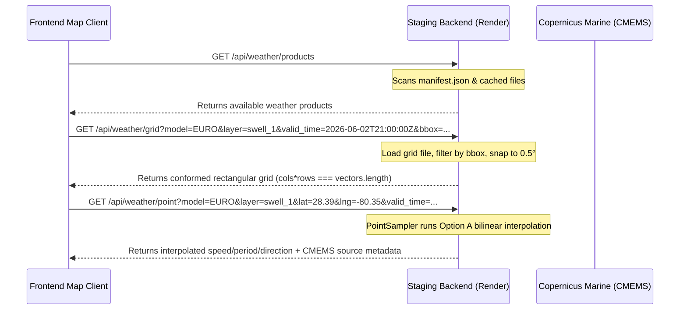

# Weather Backend Migration Roadmap

This document serves as the canonical roadmap and active architecture guide for the **Raw Surf Weather & Marine Data Simulation Engine**. It outlines our transition to a backend-owned forecast architecture, documents completed validation stages (including Copernicus Waves and GFS/ICON/EURO Wind), and details the remaining phased work for pressure, precipitation, radar, satellite, and temperature layers.

For the detailed status of all weather and marine layers, see the [weather-support-matrix.md](file:///C:/Users/dprit/Raw-Surf/docs/architecture/weather-support-matrix.md).

---

## 1. The North Star Architecture

Our core system design separates data ownership and visualization responsibilities:

> [!IMPORTANT]
> **Backend owns weather truth.** It performs all network requests, dataset queries, temporal and spatial normalizations, memory caching, and point interpolation.  
> **Frontend owns visualization.** It consumes clean API responses, renders WebGL heatmaps or particle overlays, maps timelines, and exposes diagnostic states.

> [!NOTE]
> **Pressure Layer Visuals Exceptions**:
> The map visual pressure raster contours and heatmap remain owned by the hourly legacy `om://` tiles. The backend pressure service only owns the scalar numeric point truth (`value` in hPa, NOT vector components like speed/direction) for the map inspector infobox.

### Frontend Responsibilities
The client-side application must only:
* Query the active products manifest.
* Fetch WebGL-ready coordinate grids filtered dynamically by bounding boxes (`bbox`).
* Query interpolated point/infobox forecasts for map inspector events.
* Request tile indexes or signed CDN URLs for radar/satellite layers.
* Render hardware-accelerated WebGL heatmaps and flow particles.
* Expose diagnostics states and handle unavailable fallbacks cleanly.

### Frontend Restrictions (Anti-Patterns)
The client-side application must **not**:
* Fetch raw forecast parameters directly from external weather APIs (e.g. Open-Meteo or Copernicus).
* Run NetCDF/GRIB download operations.
* Fabricate synthetic weather values or generate in-memory mock fallbacks.
* Perform model-specific math or meteorology calculations.
* Duplicate weather ingestion or storage pipelines.

---

## 2. Backend Weather Product Contract

The weather engine exposes three core REST endpoints on the backend service, with additional endpoints planned for tile and timeline queries.

### API Endpoints
* **`GET /api/weather/products`**: Returns the manifest registry listing available prepared weather products, freshness timestamps, and files cached on disk.
* **`GET /api/weather/grid`**: Returns a compact normalized coordinate grid. Acceptable query parameters: `model`, `domain`, `layer`, `valid_time`, and an optional boundary filtering `bbox`.
* **`GET /api/weather/point`**: Samples from the exact same cached product grid used for the map grids, ensuring absolute grid-to-point parity. Returns interpolated values or handles bounds fallbacks.
* **Future `GET /api/weather/tile` or `/api/weather/tiles`**: Will handle imagery-based products (radar, satellite) by returning signed tile URLs or session tokens.
* **Future `GET /api/weather/timeline`**: Will return a compact array of available valid time slices across all layers to sync timeline scrub controls dynamically.

### Schema Fields & Metadata
All backend products and point/grid responses propagate these metadata fields:

| Field | Type | Description |
| :--- | :--- | :--- |
| **`model`** | `str` | Name of the forecast model (e.g., `GFS`, `ICON`, `EURO`). |
| **`provider`** | `str` | Ingestion source (e.g., `open-meteo`, `copernicus`). |
| **`domain`** | `str` | Data domain (`marine` or `wind`). |
| **`layer`** | `str` | Target physical parameter layer (e.g., `waves`, `swell_1`, `swell_2`, `wind`). |
| **`valid_time_start`** | `datetime` | Starting validation timestamp (ISO-8601 UTC). |
| **`valid_time_end`** | `datetime` | Ending validation timestamp (ISO-8601 UTC). |
| **`run_time`** | `datetime` | Model execution/ingestion run timestamp. |
| **`coverage`** | `CoverageBounds` | Geographic coordinates bounds containing the grid values. |
| **`units`** | `dict` | Maps variables to standard units (e.g., speed to `m` or `kn`, period to `seconds`). |
| **`source_dataset`** | `str` | The real CMEMS or NOAA source dataset name (e.g., `cmems_mod_glo_wav_anfc_0.083deg_PT3H-i`). |
| **`source_variables`** | `List[str]` | The specific variable codes queried from the source dataset (e.g., `["VHM0_SW1", "VMDR_SW1", "VTM01_SW1"]`). |
| **`is_forecast_authoritative`**| `bool` | True only if the forecast contains real live forecast measurements. |
| **`is_estimated`** | `bool` | True if the forecast is interpolated, out-of-bounds, or uses fallbacks. |
| **`is_test_fixture`** | `bool` | True if the product is a mock test file. Never allowed in production manifests. |
| **`freshness_sec`** | `int` | Ingestion validity window (e.g., `1800` seconds). |
| **`gridMode`** | `str` | Grid layout description (must be `"rectangular"`). |
| **`interpolationMethod`** | `str` | Point lookup method (`"bilinear"`, `"bilinear_ocean_masked"`, `"nearest_ocean_fallback"`, `"out_of_bounds_fallback"`, or `"unavailable"`). |
| **`fallbackReason`** | `str` | Logs details of why a fallback or estimate occurred. |

---

## 3. Completed Stages

We have forensically implemented and verified these weather backend milestones:

* **Stage 1: Backend Weather Product Foundation**: Created conformed schemas, store registry, and manifest.
* **Stage 2: GFS Waves Pilot**: Ingested GFS wave grid from Open-Meteo with wind vector conversions.
* **Stage 2.7: Deployed GFS Waves Truth Gate**: Verified staging and client redirections.
* **Stage 3A-C: Backend GFS Wind Pilot + Deployed Truth Gate**: Integrated wind particle flow vectors.
* **Stage 4A.1-4A.5: Copernicus Swell 1 Pilot**: Added regional CMEMS extraction under 512MB RAM cap.
* **Stage 4A.6: Grid Coherence and Point Hardening**: Standardized Option A bilinear ocean-masked coastline point sampling.
* **Stage 4B: Copernicus Swell 2 Ingest & Data Proof**: Integrated secondary swell (`swell_2`).
* **Stage 4C: Copernicus Wind Waves Ingestion**: Integrated conformed wind waves (`wind_waves`).
* **Stage 4D: Copernicus Base EURO Waves Ingestion**: Consolidated all EURO wave heights to Copernicus.
* **Stage 4E: GFS Marine Components Ingestion**: Conformed GFS waves, swell_1, swell_2, and wind_waves to backend.
* **Stage 4F: ICON Marine Components Ingestion**: Conformed ICON waves, swell_1, and wind_waves to backend (swell_2 unsupported).
* **Stage 5C: ICON Wind Ingestion**: Integrated ICON wind with gust support.
* **Stage 5D: EURO Wind Ingestion**: Integrated EURO wind (`ecmwf_ifs`) with gust support.
* **Stage 5E: Wind Consolidation Gate**: Verified timeline parity and protected ingestion endpoints.
* **Stage 5F: Wind Default-On Rollout**: Enabled backend wind service by default on map client.
* **Stage 5G: Wind Post-Rollout Stabilization Watch**: Verified default-on redirection stability.
* **Stage 6C: Pressure Backend Migration Plan**: Analyzed pressure layer structure and upstream sources.
* **Stage 6D: GFS Pressure Backend Pilot**: Integrated GFS weather pressure under default-off feature flag.
* **Stage 6E: ICON/EURO Pressure Ingestion + Redirects**: Extended pressure pilot to ICON and EURO models, reframing parity as snapped tolerance parity.
* **Stage 6F: Pressure Consolidation Gate**: Hardened out-of-coverage semantics, conformed diagnostics keys, and consolidated pressure matrices.

---

## 4. Backend-Owned Product Pipeline Architecture

The weather data pipeline is structured for efficiency, correctness, and stability under strict memory and API limits.

### A. Provider Ingestion Model
Ingestion is orchestrated via `scheduler.py`:
* **Open-Meteo Ingestion**: Grid coordinate requests are chunked into batches of **100 coordinates** to prevent HTTP 414 URI Too Long. An inter-request delay is enforced (2.5s for wind, 1.2s for marine) to respect API rate limits.
* **Copernicus Ingestion**: Subprocess NetCDF downloads are capped to prevent out-of-memory crashes on Render. Python garbage collection (`gc.collect()`) is run aggressively between cycles.

### B. Product Manifest Behavior
* The master catalog `manifest.json` registers all available weather files.
* Every grid and point API query scans this manifest to locate the conformed file closest to the requested coordinate/valid_time.
* Atomic file replacements (`os.replace`) prevent partial grid files from being read.

### C. API Endpoint Contracts
* **`/api/weather/grid`**: Receives target model, domain, layer, and ISO-8601 valid_time. Bounding box filters (`bbox=west,south,east,north`) are evaluated on the fly to slice the rectangular grid coordinates.
* **`/api/weather/point`**: Evaluates coordinate sample requests. Uses the **Option A** IDW bilinear interpolation algorithm to interpolate values over ocean grid nodes, safely filtering out coastal land interference.

### D. Temporal Valid-Time Snapping
* Grid and point queries snap target timestamps to the closest available manifest product validity window (within a **3-hour delta limit**). If a valid slice is beyond 3 hours, a `404 Not Found` response is raised.

### E. Frontend Adapter Pattern
* `backendWeatherServiceClient.js` wraps backend network queries, clamps viewport bounding boxes, maps models to their upstream API identifiers (e.g. mapping `model: 'EURO'` to `upstream_model: 'ecmwf_ifs'`), and updates diagnostics telemetry.

### F. Feature Flags & Rollback Strategy
* **Runtime Rollbacks**: The console global `window.__USE_BACKEND_WIND_SERVICE__ = false` or the local storage key `__USE_BACKEND_WIND_SERVICE__ = 'false'` instantly roll back wind fetches to legacy pathways. Similar overrides exist for marine (`__USE_BACKEND_MARINE_SYSTEM__ = false`).
* **Build-Time Rollbacks**: Compiling the app with `REACT_APP_USE_BACKEND_WIND=false` or `REACT_APP_USE_BACKEND_MARINE_SYSTEM=false` overrides default-on behavior at build time.

### G. Diagnostics Telemetry Objects
Globals are registered on `window` to check telemetry:
* `window.__BACKEND_WEATHER_SERVICE_DIAG__` (GFS marine)
* `window.__BACKEND_WIND_SERVICE_DIAG__` (wind models)
* `window.__BACKEND_COPERNICUS_SERVICE_DIAG__` (EURO/Copernicus marine)

### H. Unsupported and No-Coverage Semantics
* Coordinates falling outside the Florida pilot bbox (`PILOT_COVERAGE`) return `is_estimated = False` with `is_forecast_authoritative = False` and `point.interpolation_method = "out_of_bounds_fallback"`, indicating no coverage exists rather than presenting it as a real forecast estimate.
* Unsupported layer requests (e.g., ICON `swell_2`) return a conformed mock response with `status: 'unsupported'` safely to prevent API queries or crashes.

### I. Test-Fixture Quarantine Rules
* Deployed environments strictly prohibit mock files. The scheduler checks `is_test_env` before saving files. Any product marked with `is_test_fixture = True` is blocked from registry writes.

### J. Scheduler Rate-Limit Strategy
* A **15.0-second stagger delay** separates all manual ingestion background tasks.
* A staggered retry backoff multiplier (`12s * attempt`) handles any HTTP 429 response from Open-Meteo.

---

## 5. Legacy Fallback Audit

While marine and wind systems are fully backend default-on, their legacy serverless proxy scraper paths remain intact:
* **Retained Marine Paths**: Frontend direct fetches to the Open-Meteo Marine API, client-side GFS/ICON GRIB parsing, and Copernicus tile loaders in `useMarineOrchestrator.js` and `marineController.js`.
* **Retained Wind Paths**: Client-side scrapers in `windController.js` and direct point sampling queries in `forecastSamplers.js`.
* **Rollback Usefulness**: Provides immediate redundancy in case of staging server outages (Render 502/OOM errors), Copernicus API credential locks, or Open-Meteo IP address blocks.
* **Sunsetting Candidates**: Once the backend service proves stable across a **30-day confidence window**, client-side NetCDF/GRIB download and legacy Open-Meteo scrapers can be removed.

---

## 6. Weather Regression Archaeology & Backend Stabilization

To prevent recurring bugs and ensure long-term stability, we document the history of regressions, define strict backend API contracts, and establish regression test gates that must pass before any milestone is marked complete.

### A. Regression Archaeology

| Regression | User Symptom | Root Cause Pattern | Files/Systems Involved | Fix Attempted | Permanent Backend Fix | Regression Test Gate |
| :--- | :--- | :--- | :--- | :--- | :--- | :--- |
| **Marine forecast freeze** | Marine heatmap live works, but forecast does not move when scrubbing timeline. | Timeline scrub state change did not trigger WebGL texture invalidation/upload because the comparison signature omitted `valid_time`, or React state updates suffered from timeOffsetRef race conditions. | `MapWebGL.js` `WebGLMarineEngine.js` `useMarineOrchestrator.js` | Force-rendering components or clearing caches. | Incorporate `product_id` + `valid_time` + `bounds` into WebGL texture upload signature. Force invalidation on timeline updates. | Verify `webglUploadCount` increments and texture hashes change when timeline scrubbing. |
| **Infobox discrepancy** | Infobox future values differ from heatmap colors at the same location. | Spot/point sampler queried Open-Meteo directly or utilized a different run/model instead of matching the exact product rendered in the grid. | `backend/routes/weather.py` `forecastSamplers.js` `backendWeatherServiceClient.js` | Snapping client-side valid_times. | Enforce Grid/Point Parity Contract: pass `grid_product_id` in point query, backend loads and samples that exact product. | Verify point API matches conformed grid values exactly when `grid_product_id` is supplied. |
| **TRACE / default values** | Infobox displays "TRACE", empty string, or 0 instead of real wind/wave values. | Bilinear point interpolation failed near coastlines or grid borders (returning NaN or unhandled exceptions), falling back silently to empty/zero mock values. | `backend/services/weather_pipeline/sampler.py` `forecastSamplers.js` | Nearest-neighbor fallback returning arbitrary coordinates. | Implement bilinear ocean-masked interpolation with explicit coastline check, falling back to `nearest_ocean_fallback` or `out_of_bounds_fallback`. | Validate point sampler output for coordinates near land bounds. |
| **EURO native cutoff failure** | Map showing blank areas or console errors beyond 72 hours for EURO model. | Copernicus wave forecast (CMEMS) only has a native 72-hour limit. Requesting times > 72h returned empty grids or 404s. | `scheduler.py` `backend/routes/weather.py` `CopernicusGridFetcher.js` | Client-side blending logic. | Generate estimated Copernicus products beyond 72h backend-side, decaying to GFS trend and marking `is_estimated = True`. | Test backend returns conformed estimated files for EURO waves when valid_time > 72h. |
| **Model cache pollution** | Map renders data from a previously selected model (e.g. GFS waves showing on EURO). | Overlapping cache keys on the backend or in client-side memory cache, lacking model/layer descriptors in the unique keys. | `backend/routes/weather.py` `backend/services/weather_pipeline/store.py` `marineController.js` | Clearing browser caches on click. | Enforce structured cache key uniqueness incorporating `model` + `domain` + `layer` + `valid_time` + `bbox_bounds`. | Automated test checking that cache keys vary uniquely across model and layer parameters. |
| **WebGL upload skipped** | New forecast run is available, but map client fails to display updated values. | WebGL texture manager compared only time offset and bounds, missing that the underlying `product_id` (run time) changed. | `WebGLMarineEngine.js` `MapWebGL.js` | Page reload or cache clear. | WebGL upload signature includes `product_id` to force texture invalidation when a new model run is fetched. | Verify `webglUploadCount` increments when a new product_id is loaded for the same valid_time. |
| **Florida-only grid stretched** | Florida-only regional grid rendered as global coverage, distorting coordinates. | Shader projection lacked correct coordinate bounds scaling, stretching the Florida 2D texture (0 to 1 UV) over the entire viewport. | `WebGLMarineShaders.js` `WebGLWindShaders.js` | Client-side CSS bounds clipping. | Implement Web Mercator projection in shaders and clip/scale coordinate mapping based on `u_dataBounds_min` and `u_dataBounds_max` uniforms. | Verify that shaders draw textures only within defined product boundaries. |
| **Wind particles boundary wrap** | Wind particles show a hard regional rectangle, wrapping or disappearing abruptly. | Advection shader wrapped particles unconditionally on X/Y boundaries via `fract(pos.x)`, and there was no alpha transition near edges. | `WebGLWindShaders.js` `WebGLWindEngine.js` | Restricting particle creation coordinates. | Disable X wrapping for regional bounds (`u_edgeFeatherEnabled = true`) and apply `smoothstep` boundary feathering. | Visual/automated validation of boundary opacity fade-out. |
| **Land/ocean mask inversion** | Heatmap rendered on land and masked out over the ocean. | Y-flip orientation mismatch during texture upload (`UNPACK_FLIP_Y_WEBGL` state pollution) or linear projection instead of Web Mercator projection. | `WebGLMarineTextureEncoder.js` `WebGLMarineShaders.js` | Inverting color values in the shader. | Wrap mask upload in explicit `gl.pixelStorei(gl.UNPACK_FLIP_Y_WEBGL, true)` and restore it, and project mask coordinates using Web Mercator formulas. | Mask alignment verification tests. |
| **Silent weather-proxy fallback** | System breaks but fails silently, serving stale or incorrect data. | Exception handling caught fetch failures and silently fell back to legacy proxy or Open-Meteo scraper without setting `gridParity: false`. | `backendWeatherServiceClient.js` `useMarineOrchestrator.js` | Console warnings. | Mandatory diagnostics telemetry, reporting `source: "backend_direct_point"` and `fallback_reason` in the response payload. | Point API response validation for fallback indicators. |
| **Diagnostics missing/misleading** | Developer panel displays incorrect product IDs or states, making debugging impossible. | Diagnostics objects (`window.__BACKEND_WEATHER_SERVICE_DIAG__`) were not initialized correctly, or values were not propagated. | `backendWeatherServiceClientDiag.js` `backendWeatherServiceClient.js` | Manual console logging. | Standardized telemetry object structure on the client window, populated on every network fetch. | Telemetry completeness checks. |
| **Deployed visual UI failure** | Backend parity passing in CI/CD while deployed visual UI still fails. | Backend parity did not test visual projection artifacts, WebGL upload states, or CORS/CSP headers that only trigger in live environments. | Full deployment pipeline, E2E gates. | Manual browser testing. | Required Deployed E2E visual truth gates, including screenshot comparisons and timeline matrices, before marking a stage PASS. | Deployed visual/functional smoke test suite. |
| **Wind flashing on pan/zoom** | Wind particles flash and reset to a grainy or blank state when dragging or zooming the map. | Zooming/panning triggers multiple concurrent grid fetches that resolve out-of-order, causing newer renders to be overwritten by slower, stale responses. | `backendWindServiceClient.js` | Adding local state flags. | Implement client-side in-flight request deduplication via `inFlightWindRequests = new Map()`, sharing and clean-up of active fetch promises. | Verify concurrent requests for identical URLs return the same promise. |
| **Wind particles heatmap blockage** | Wind particle trails cover up the underlying faster wind reds/purples, forming a foggy white sheet. | Advection drawing fragment shader completely ignores speed-dependent alpha from the color ramp LUT (`u_color_ramp`), rendering slow/calm particles at full opacity. | `WebGLWindShaders.js` `WebGLWindEngine.js` | Lowering the total particle count. | Multiply color ramp alpha by `v_alpha` in `DRAW_FS`. Tune `fadeOpacity` to `0.965` and composite opacity to `0.48` for crisp, non-foggy trails. | Verify red/purple heatmap layers remain clearly visible underneath active wind particles. |
| **Marine layer high stability** | Marine layer is highly stable compared to wind, without flashing or visual inconsistencies. | Marine layer utilizes a strict orchestration state lock and unique SWR cache key registry which prevents overlapping requests and out-of-order updates. | `useMarineOrchestrator.js` `marineController.js` | N/A | Leverage the marine orchestrator's state lock design patterns and SWR cache key registry, applying deduplication to other volatile layers. | Verify state transitions do not overlap. |

---

### B. Backend Truth Contract

Every backend-served weather product must satisfy this permanent data contract:
1. **`product_id`**: Globally unique UUID or hash representing the exact ingestion run.
2. **`model`**: Standardized string identifier (`GFS`, `ICON`, `EURO`).
3. **`domain`**: Either `marine` or `wind`.
4. **`layer`**: Physical variable (e.g. `waves`, `swell_1`, `swell_2`, `wind_waves`, `wind`).
5. **`valid_time`**: ISO-8601 UTC timestamp representing the valid forecast hour.
6. **`requested_bbox`**: Bounding box coordinates submitted by the client `[west, south, east, north]`.
7. **`served_bbox`**: Actual coordinate limits of the grid returned.
8. **`coverage_scope`**: Declared scope: `regional` | `viewport` | `global_coarse` | `mosaic` | `no_coverage`.
9. **`source`**: Provider identifier (e.g. `copernicus`, `open-meteo`).
10. **`is_estimated`**: True if the grid includes computed or blended variables.
11. **`estimate_basis`**: Explanation of estimation math (e.g. `gfs_blend` or `none`).
12. **`cache_key`**: Deterministic key integrating model, layer, valid_time, and bounding box.
13. **`product family/index entry`**: Registered in the active catalog (`manifest.json` or `dynamic_products_index.json`).
14. **`vectorCount` / `nonzeroCount`**: Grid dimensions and non-zero counts for verification.
15. **`grid/point compatibility`**: Conformed coordinate alignment.

---

### C. Grid/Point Parity Contract

To eliminate differences between visual maps and spot data:
1. **Valid Time Snapping**: `/grid` and `/point` must resolve to the exact same `valid_time`.
2. **Strict Product Sampling**: If a client provides `grid_product_id`, the `/point` endpoint must sample exactly from that cached grid file.
3. **Out-of-bounds Enforcement**: If the requested point falls outside the bounding box of the specified `grid_product_id`, the API must return an explicit `out_of_bounds` response with `interpolation_method = "out_of_bounds"`.
4. **No Silent Fallback**: The server must never fall back silently to other models or times.
5. **Direct Point Fallback Labeling**: If no grid exists, point-only fallbacks must return `source: "backend_direct_point"` and `gridParity: false`.

---

### D. Coverage Contract

1. **No Regional Stretching**: Regional products must never be stretched. Geographies must map exactly to coordinate coordinates using Web Mercator formulas.
2. **Dynamic Viewport Generation**: Viewport grids must be dynamically queried, conformed, and cataloged in the transient index (`dynamic_products_index.json`).
3. **Metadata Declaration**: Every API grid payload must explicitly declare `coverage_scope`, `requested_bbox`, `served_bbox`, and `resolution`.
4. **Frontend Respect**: Frontend renderers must inspect `coverage_scope` to apply correct projection matrix boundaries.

---

### E. EURO Extended Forecast Contract

1. **Backend-Owned Estimates**: The legacy client-side Copernicus extended forecast math is fully migrated to the backend.
2. **Shared Metadata**: Estimated grid and point products must share the same `product_id` family, `valid_time`, `is_estimated = True`, and `estimate_basis = "gfs_blend"`.
3. **UI Distinction**: The UI must display an "Estimated" badge when `is_estimated` is true.
4. **Stale Invalidation**: No stale Copernicus heatmap may remain visible once the native forecast ends.

---

### F. Legacy Frontend Weather Math Quarantine

To clean up the client codebase, we establish a quarantine schedule for legacy scrapers:

| Math Code Area | Current Role | Quarantine Status | Target Removal |
| :--- | :--- | :--- | :--- |
| **Direct Open-Meteo Fetches** | Client-side requests for wind/marine | **Quarantined** (feature flag disabled) | Stage 6M |
| **`/api/weather-proxy`** | Netlify serverless scraper | **Quarantined** (used as emergency fallback) | Stage 6M |
| **Frontend EURO blending** | Blending GFS/Copernicus client-side | **Quarantined** (bypassed) | Stage 6M |
| **Local Cache Override** | Client-side time remap logic | **Quarantined** (disabled) | Stage 6M |
| **Silent Fallback Paths** | Catch-block redirections to scrapers | **Keep as explicit fallback** | Retain for 30-day stability window |

---

### G. Regression Test Gates

Before any weather stage can be marked **PASS**, it must clear these gates:

#### 1. Backend Verification Gates
* **Valid Time Snapping**: Tests snap queries to the closest available manifest product within 3 hours.
* **Viewport Generation**: Tests verify dynamic viewport grids resolve to adaptive resolutions.
* **Strict Point Sampling**: Verify `/point?grid_product_id=X` fails or clamps to out-of-bounds when outside X.
* **EURO Extended Estimate**: Check estimated forecast returns `is_estimated = True`.
* **Cache Key Uniqueness**: Verify no collision exists when changing layers or models.

#### 2. Frontend Verification Gates
* **Scrub Signature Invalidation**: Verify timeline shifts update `product_id` and recreate the WebGL upload signature.
* **Infobox Sync**: Verify the map click queries point data matching the active map layer.
* **No Silent Fallback**: Ensure network failures show a clear UI warning instead of silent scraping.
* **WebGL Bounds Alignment**: Verify texture uploads map to the exact `served_bbox`.

#### 3. Deployed E2E Gates
* **Live + Forecast Matrix**: Verify the timeline works from Live out to +120h on staging.
* **Screenshot Verification**: Visual check of heatmap boundaries, land masking, and flow particles.
* **Diagnostics Verification**: Verify `window.__WEATHER_GRID_PROJECTION_DIAG__` has correct counts and `gridParity: true`.

---

## 7. Remaining Layers Source-Truth Plan

We will evaluate the remaining map layers for migration to the backend-owned weather engine:

### A. Sea-Level Pressure
* **Likely Source**: Open-Meteo Forecast API (`gfs_seamless`, `dwd_icon`, `ecmwf_ifs`).
* **Data Type**: Forecast model grid parameters (`pressure_msl`).
* **Backend Fit**: Fits the backend grid/point product model perfectly. Can be normalized into conformed JSON grids.
* **Difficulty**: Low.

### B. Precipitation (Rain/Snow)
* **Likely Source**: Open-Meteo Forecast API (`precipitation`).
* **Data Type**: Forecast model grid parameters (precipitation values in `mm`).
* **Backend Fit**: Fits the backend grid/point product model.
* **Difficulty**: Low.

### C. Weather Radar
* **Likely Source**: RainViewer API or NOAA MRMS.
* **Data Type**: Real-time mosaic tiles.
* **Architecture Fit**: Should remain tile-based, loaded via MapLibre overlay protocols, with timeline synchronization managed by the backend.
* **Difficulty**: Medium.

### D. Satellite Imagery
* **Likely Source**: NOAA GOES / NASA GIBS.
* **Data Type**: Real-time observational tile maps.
* **Architecture Fit**: Should remain tile-based with timeline synchronization managed by the backend.
* **Difficulty**: Medium.

### E. Air Temperature (Future)
* **Likely Source**: Open-Meteo Forecast API (`temperature_2m`).
* **Data Type**: Forecast scalar field.
* **Difficulty**: Low.

### F. Sea Surface Water Temperature (Future)
* **Likely Source**: NOAA RTG_SST or CMEMS Global Ocean SST.
* **Difficulty**: Medium.

---

## 8. Revised Phased Execution Order

We revise the remaining integration stages to prioritize stabilization and regression testing before extending coverage:

1. **Stage 6J**: Dynamic viewport/global backend coverage for GFS marine + wind (Active / Code Completed).
2. **Stage 6K**: Strict `grid_product_id` point sampling + dynamic product index validation.
3. **Stage 6L**: EURO extended forecast backend contract lock.
4. **Stage 6M**: Frontend legacy weather math quarantine and scraper code cleanup.
5. **Stage 6N**: Regression test harness and deployed visual truth gates integration.
6. **Subsequent Expansion Phases**:
   - ICON/EURO viewport coverage expansion
   - Pressure layer stabilization
   - Precipitation layer backend ingestion
   - Radar & Satellite timeline sync
   - Temperature layers (Air & Water) point sampling integration

