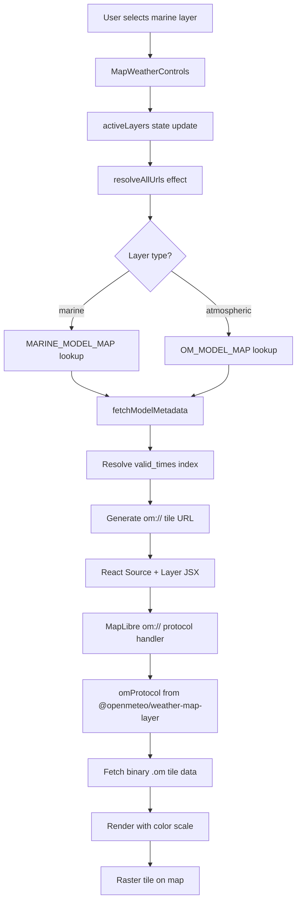

# Weather Engine Architecture

## Data Flow

## Model Routing

| User Selection | Atmospheric Model | Marine Model | Precip Model |
|---------------|------------------|--------------|--------------|
| GFS | `ncep_gfs025` | `ncep_gfswave025` | `ncep_gfs013` |
| ICON | `dwd_icon` | `dwd_gwam` | `dwd_icon` |
| EURO | `ecmwf_ifs025` | `ecmwf_wam025` | `ecmwf_ifs025` |

## Key Files

| File | Purpose |
|------|---------|
| `MapWebGL.js` | Main map component, raster tile JSX, URL resolution |
| `mapUtils.js` | om:// protocol registration, custom color scales |
| `LayerRegistry.js` | Layer metadata, model routing maps, metadata cache |
| `useMarineOrchestrator.js` | Marine grid data fetch pipeline |
| `WeatherEngine.js` | Wind data fetch for particle engine |
| `OceanMask.js` | Land masking over marine raster coastline bleed |
| `GPUMarineLayer.js` | Marine foam/crest particle canvas |
| `WindParticleOverlay.js` | Wind particle WebGL overlay |
| `useTemporalPreloader.js` | Tile pre-warming for timeline scrubbing |
